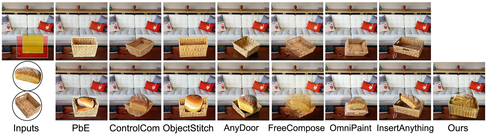

<h1 align="center">PICS: Pairwise Image Compositing with Spatial Interactions</h1>
<p align="center"></p>

***Check out our [Project Page](https://ryanhangzhou.github.io/pics/) for more visual demos!***

<!-- Updates -->
## ⏩ Updates

**02/08/2026**
- Release training and inference code.
- Release training data.

<!-- **06/24/2025**
- Release inference code and data. -->

<!-- TODO List -->
## 🚧 TODO List
- [x] Release training and inference code
- [x] Release datasets (LVIS, Objects365, etc. in WebDataset format)
- [ ] Release pretrained models (coming soon)
- [ ] Release any-object compositing code

<!-- Installation -->
## 📦 Installation

### Prerequisites
- **System**: Linux (Tested on Ubuntu 20.04/22.04).
- **Hardware**: 
  - **GPU**: NVIDIA GPU with at least **40GB VRAM** (e.g., A6000, A100, H100). 
  - **RAM**: Minimum 64GB system memory recommended.
- **Software**:   
  - [Conda](https://docs.anaconda.com/miniconda/install/#quick-command-line-install) is recommended.  
  - **Python 3.10** or higher.

### Environment Setup
  Create a new conda environment named `PICS` and install the dependencies: 
  ```
  conda env create --file=PICS.yml
  conda activate PICS
  ```

### Weights Preparation
1. ***DINOv2***: Download [ViT-g/14](https://dl.fbaipublicfiles.com/dinov2/dinov2_vitg14/dinov2_vitg14_pretrain.pth) and place it at: checkpoints/dinov2_vitg14_pretrain.pth
2. ***PICS Checkpoints***: (Links will be updated once uploaded to Google Drive/Hugging Face).
  <!-- Download the [ViT-g/14](https://dl.fbaipublicfiles.com/dinov2/dinov2_vitg14/dinov2_vitg14_pretrain.pth) version of DINOv2 for object feature extraction and put it in the directory ```PICS/checkpoints/dinov2_vitg14_pretrain.pth```.  -->


<!-- Pretrained Models -->
## 🤖 Pretrained Models
Coming soon! We are currently finalizing the model weights for public release.
<!-- We provide the following pretrained models:

| Model | Description | #Params | Download |
| --- | --- | --- | --- |
| BOOTPLACE_Cityscapes | Multiple supervision | 523M | [Download](https://drive.google.com/file/d/1OeCourPQf1a6yM2BYNNuUKI3yvXRcD_N/view?usp=drive_link) | -->


<!-- Usage -->
<!-- ## 💡 Usage

### Minimal Example

Here is an [example](test.py) of how to use the pretrained models for object placement. -->


<!-- Dataset -->
## 📚 Dataset
Our training set is a mixture of [LVIS](https://www.lvisdataset.org/), [VITON-HD](https://www.kaggle.com/datasets/marquis03/high-resolution-viton-zalando-dataset), [Objects365](https://www.objects365.org/overview.html), [Cityscapes](https://www.cityscapes-dataset.com/), [Mapillary Vistas](https://www.mapillary.com/dataset/vistas) and [BDD100K](https://bair.berkeley.edu/blog/2018/05/30/bdd/). 
We provide the processed ***two-object compositing data*** in WebDataset format (.tar shards) below:
| Model | #Sample | Size | Download |
| --- | --- | --- | --- |
| LVIS | 34,160 | 7.98GB | [Download](https://drive.google.com/drive/folders/1Ir1cwR7K8HALNJiS6kTTlMgKIn8f18XX?usp=sharing) |
| VITON-HD | 11,647 | 2.53GB | [Download](https://drive.google.com/drive/folders/1317fJvvc7J1OTdbiM_Rst0C9AewIcNr2?usp=sharing) |
| Objects365 | 940,764 | TODO | [Download]() |
| Cityscapes | 536 | 1.21GB | [Download](https://drive.google.com/drive/folders/1HYgEgZcknvEMbK2XZf2isY0pYcluGoKU?usp=sharing) |
| Mapillary Vistas | 603 | 581.5MB | [Download](https://drive.google.com/drive/folders/1a0756wc2bvvHJ_8a01N0tZ_Kb_BkRZv1?usp=sharing) |
| BDD100K | 1,012 | 204MB | [Download](https://drive.google.com/drive/folders/1zS60KPfZioU4tW1ngDK1KahE7T-TeIim?usp=sharing) |

## Data Organization
```
PICS/
├── data/
    ├── train/
        ├── LVIS/
            ├── 00000.tar
            ├── ...
        ├── VITONHD/
        ├── Objects365/
        ├── Cityscapes/
        ├── MapillaryVistas/
        ├── BDD100K/
```

## Training

<!-- To train a model on Cityscapes:
```
python -m main \
    --epochs 200 \
    --batch_size 2 \
    --save_freq 10 \
    --set_cost_class 1 \
    --ce_loss_coef 1 \
    --num_queries 120 \
    --eos_coef 0.1 \
    --lr 1e-4 \
    --data_path data/Cityscapes \
    --output_dir results/Cityscapes_ckpt \
    --resume weights/detr-r50-e632da11.pth
``` -->

## Inference
<!-- ```
python test.py \
    --num_queries 120 \
    --data_path data/Cityscapes \
    --pretrained_model 'results/Cityscapes_ckpt/checkpoint.pth' \
    --im_root 'data/Cityscapes/test' \
    --output_dir 'results/Cityscape_inference'
```
 -->


<!-- License -->
## ⚖️ License

This project is licensed under the terms of the MIT license.


<!-- Citation -->
## 📜 Citation

<!-- If you find this work helpful, please consider citing our paper: -->

<!-- ```bibtex
@inproceedings{zhou2025bootplace,
  title={BOOTPLACE: Bootstrapped Object Placement with Detection Transformers},
  author={Zhou, Hang and Zuo, Xinxin and Ma, Rui and Cheng, Li},
  booktitle={Proceedings of the Computer Vision and Pattern Recognition Conference},
  pages={19294--19303},
  year={2025}
}
``` -->