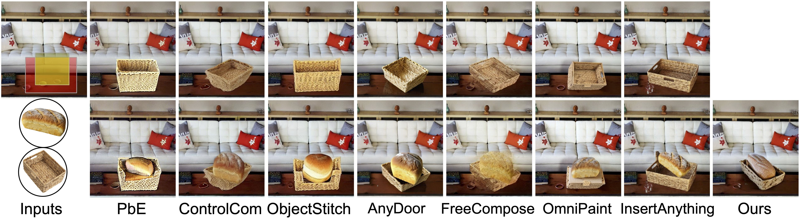

<!--  &nbsp;
 <a href='https://ryanhangzhou.github.io/pics/'></a> &nbsp;
[](https://huggingface.co/RyanHangZhou/PICS)&nbsp;
[](https://huggingface.co/spaces/RyanHangZhou/PICS)
[](https://openreview.net/pdf?id=zNCNEOhKps)
 -->

 &nbsp;
<a href='https://ryanhangzhou.github.io/pics/'></a> &nbsp;
[](https://huggingface.co/RyanHangZhou/PICS)&nbsp;
[](https://huggingface.co/spaces/RyanHangZhou/PICS)&nbsp;
[](https://openreview.net/pdf?id=zNCNEOhKps)

 <!-- <a href='https://arxiv.org/abs/2501.03847'></a> &nbsp; -->

<h1 align="center">PICS: Pairwise Image Compositing with Spatial Interactions</h1>
<p align="center"></p>

***Check out our [Project Page](https://ryanhangzhou.github.io/pics/) for more visual demos!***

<!-- Updates -->
## ⏩ Updates

**02/08/2026**
- Release training and inference code.
- Release training data.

**03/01/2025**
- Release checkpoints. 

<!-- TODO List -->
## 🚧 TODO List
- [x] Release training and inference code for pairwise image compositing
- [x] Release datasets (LVIS, Objects365, etc. in WebDataset format)
- [x] Release pretrained models
- [ ] Release any-object compositing code

<!-- Installation -->
## 📦 Installation

### Prerequisites
- **OS**: Linux (Tested on Ubuntu 20.04/22.04).
- **Python**: 3.10 or higher.
- **Package Manager**: [Conda](https://docs.anaconda.com/miniconda/install/#quick-command-line-install) is recommended.   

**Hardware Requirements**
| Stage | GPU (VRAM) | System RAM | Batch Size |
| --- | --- | --- | --- |
| Training | NVIDIA H100 (80GB) | 120GB | 16 |
| Inference | NVIDIA RTX A6000 (48GB) | 64GB | 1 |

### Environment setup
  Create a new conda environment named `PICS` and install the dependencies: 
  ```
  conda env create --file=PICS.yml
  conda activate PICS
  ```

### Weights preparation
***DINOv2***: Download [ViT-g/14](https://dl.fbaipublicfiles.com/dinov2/dinov2_vitg14/dinov2_vitg14_pretrain.pth) and place it at: checkpoints/dinov2_vitg14_pretrain.pth

<!-- Pretrained Models -->
## 🤖 Pretrained Models
<!-- Coming soon! We are currently finalizing the model weights for public release. -->
We provide the following pretrained models (to be placed at the same directory with DINOv2):

| Model | Description | size | Download |
| --- | --- | --- | --- |
| PICS | Full model | 18.45GB | [Download](https://drive.google.com/file/d/17JpvhRvHFjfqQDiV9RFfgjGa0iLropXK/view?usp=sharing) |


## Minimal Example for Inference

Here is an [example](run_test.py) of how to use the pretrained models for pairwise image compositing.
Run two-object compositing mode: 
```
python run_test.py \
    --input "sample" \
    --output "results/sample" \
    --obj_thr 2
```


<!-- Dataset -->
## 📚 Dataset
Our training set is a mixture of [LVIS](https://www.lvisdataset.org/), [VITON-HD](https://www.kaggle.com/datasets/marquis03/high-resolution-viton-zalando-dataset), [Objects365](https://www.objects365.org/overview.html), [Cityscapes](https://www.cityscapes-dataset.com/), [Mapillary Vistas](https://www.mapillary.com/dataset/vistas) and [BDD100K](https://bair.berkeley.edu/blog/2018/05/30/bdd/). 
We provide the processed ***two-object compositing data*** in WebDataset format (.tar shards) below:
| Model | #Sample | Size | Download |
| --- | --- | --- | --- |
| LVIS | 34,160 | 7.98GB | [Download](https://drive.google.com/drive/folders/1Ir1cwR7K8HALNJiS6kTTlMgKIn8f18XX?usp=sharing) |
| VITON-HD | 11,647 | 2.53GB | [Download](https://drive.google.com/drive/folders/1317fJvvc7J1OTdbiM_Rst0C9AewIcNr2?usp=sharing) |
| Objects365 | 940,764 | 243GB | [Download](https://drive.google.com/drive/folders/1xKLoGv8e5wkGkjdxEGpz5i9TH08vd1AA?usp=sharing) |
| Cityscapes | 536 | 1.21GB | [Download](https://drive.google.com/drive/folders/1HYgEgZcknvEMbK2XZf2isY0pYcluGoKU?usp=sharing) |
| Mapillary Vistas | 603 | 582MB | [Download](https://drive.google.com/drive/folders/1a0756wc2bvvHJ_8a01N0tZ_Kb_BkRZv1?usp=sharing) |
| BDD100K | 1,012 | 204MB | [Download](https://drive.google.com/drive/folders/1zS60KPfZioU4tW1ngDK1KahE7T-TeIim?usp=sharing) |

### Data organization
```
PICS/
├── data/
    ├── train/
        ├── LVIS/
            ├── 00000.tar
            ├── ...
        ├── VITONHD/
        ├── Objects365/
        ├── Cityscapes/
        ├── MapillaryVistas/
        ├── BDD100K/
```

### Data preparation instruction
We provide a script using SAM to extract high-quality object silhouettes for the Objects365 dataset.
To process a specific range of data shards, run:
```
python scripts/annotate_sam.py --is_train --index_low 00000 --index_high 10000
```
To process raw data (e.g., LVIS), run the following command. Replace /path/to/raw_data with your actual local data path:
```
python -m datasets.lvis \
    --dataset_dir "/path/to/raw_data" \
    --construct_dataset_dir "data/train/LVIS" \
    --area_ratio 0.02 \
    --is_build_data \
    --is_train
```

## Training

To train a model on the whole dataset:
```
python run_train.py \
    --root_dir 'LOGS/whole_data' \
    --batch_size 16 \
    --logger_freq 1000 \
    --is_joint
```


<!-- License -->
## ⚖️ License

This project is licensed under the terms of the MIT license.


<!-- Citation -->
<!-- ## 📜 Citation -->

<!-- If you find this work helpful, please consider citing our paper: -->

<!-- ```bibtex
@inproceedings{zhou2025bootplace,
  title={BOOTPLACE: Bootstrapped Object Placement with Detection Transformers},
  author={Zhou, Hang and Zuo, Xinxin and Ma, Rui and Cheng, Li},
  booktitle={Proceedings of the Computer Vision and Pattern Recognition Conference},
  pages={19294--19303},
  year={2025}
}
``` -->

## 🙌 Acknowledgements
We would like to thank the contributors to the [AnyDoor](https://huggingface.co/papers/2307.09481) repository for their open research.

## Contact Us
For any inquiries, feel free to open a GitHub issue or reach out via email.
